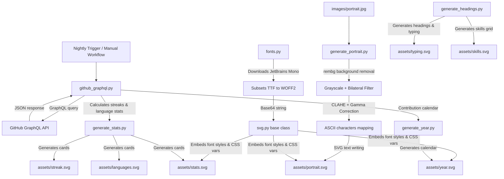

# Technical Documentation & User Guide

This guide details the setup, configuration, architecture, and troubleshooting procedures for the self-generating GitHub profile system.

---

## 1. Installation Guide

This system requires Python 3.10+, Git, and the GitHub CLI. Install all dependencies for your platform using the commands below:

### Fedora
```bash
# Install Python, pip, Git, and GitHub CLI
sudo dnf install -y python3 python3-pip git gh

# Install image processing system libraries
sudo dnf install -y mesa-libGL glib2
```

### Ubuntu / Debian
```bash
# Install Python, pip, Git, and GitHub CLI
sudo apt update
sudo apt install -y python3 python3-pip git gh

# Install image processing system libraries
sudo apt install -y libgl1-mesa-glx libglib2.0-0
```

### macOS
```bash
# Install Homebrew (if not installed)
/bin/bash -c "$(curl -fsSL https://raw.githubusercontent.com/Homebrew/install/HEAD/install.sh)"

# Install Python, Git, and GitHub CLI
brew install python git gh
```

### Windows (PowerShell)
```powershell
# Install Git and Python via Winget (Windows Package Manager)
winget install -e --id Git.Git
winget install -e --id Python.Python.3.10

# Install GitHub CLI
winget install -e --id GitHub.cli
```

---

## 2. CLI Commands (Start to Finish)

Follow this exact sequence to initialize the repository, configure secrets, set up the environment, and execute the generation scripts:

### Git Initialization & Repo Setup
```bash
# Initialize git repository
git init

# Add all project files
git add .
git commit -m "Initial commit of self-generating profile system"

# Authenticate with GitHub CLI
gh auth login

# Create a new repository on GitHub
gh repo create electroapex --public --confirm

# Add the remote and push
git remote add origin https://github.com/electroapex/electroapex.git
git branch -M main
git push -u origin main
```

### Local Environment & Dependency Setup
```bash
# Create a Python virtual environment
python3 -m venv venv

# Activate virtual environment
# On Linux/macOS:
source venv/bin/activate
# On Windows (PowerShell):
# .\venv\Scripts\Activate.ps1

# Install requirements
pip install -r requirements.txt
```

### Local Verification & SVG Generation
Before pushing to GitHub, you can test the scripts locally. 
> [!NOTE]
> If you run the scripts without setting `GITHUB_TOKEN`, the GraphQL client will automatically fall back to beautiful mock data so that the system generates the output files immediately.

```bash
# Run the generators in sequence
python scripts/generate_headings.py
python scripts/generate_portrait.py
python scripts/generate_stats.py
python scripts/generate_year.py
```

### GitHub Secrets & Actions Setup
To allow the GitHub Actions workflow to run successfully:
```bash
# Enable GitHub Actions workflows in the repo
gh workflow enable "Update Profile SVGs"

# Trigger a manual run of the workflow to verify it works on GitHub
gh workflow run update.yml
```

---

## 3. Configuration & Customization Guide

All settings are managed inside `scripts/config.py`.

### Change Username
Update `GITHUB_USERNAME` and `GITHUB_REPO` to point to your profile:
```python
GITHUB_USERNAME = "your_username"
GITHUB_REPO = "your_username"
```

### Modify Colors & Theme
You can adjust colors inside the `THEME` dictionary. The system will write the styles so that it automatically switches color palettes based on light or dark browser preferences.
```python
THEME = {
    "dark": {
        "bg": "#0d1117",
        "bg_card": "#161b22",
        "accent": "#58a6ff",
        # ...
    },
    "light": {
        "bg": "#ffffff",
        "bg_card": "#f6f8fa",
        "accent": "#0969da",
        # ...
    }
}
```

### Adjust ASCII Portrait Settings
Modify the `PORTRAIT` settings inside `scripts/config.py`:
- `width`: Number of characters wide (default 100). Higher numbers increase portrait detail but increase file size.
- `density_ramp`: The characters mapping from dark to light. Standard is `" .`:-=+*cs#%@"`.
- `gamma`: Adjusts light mapping. Decreasing gamma will darken the image; increasing it will make midtones brighter.

---

## 4. Architecture & Data Flow

Below is the design detailing how the generation system works:



---

## 5. Troubleshooting & FAQ

### Issue: "cv2 module not found" or "GLX errors"
**Solution**: Ensure your host environment has mesa-libGL installed (e.g. `sudo apt install libgl1-mesa-glx`). The project uses `opencv-python-headless` in `requirements.txt` to avoid needing heavy windowing system libraries, but basic GL support is still required.

### Issue: "rembg fails to load or download u2net.onnx"
**Solution**: Upon first run, `rembg` attempts to download its background removal model `u2net.onnx` from GitHub releases. If you are offline or behind a proxy, download the file manually and place it in `~/.u2net/u2net.onnx`. If it continues to fail, `generate_portrait.py` will catch the error and process the raw image directly, preserving stability.

### Issue: GitHub Action fails with "Permission to repo denied"
**Solution**: By default, GitHub Actions workflows might run with read-only permissions. The workflow in this project explicitly requests `permissions: contents: write` which overrides this. If it still fails, go to your repository Settings -> Actions -> General -> Workflow permissions and select "Read and write permissions".

---

## 6. Performance & Optimization

- **Font Subsetting**: The system downloads a regular JetBrains Mono font (~1.2MB). If embedded in raw format, it would make the SVGs too heavy. By executing a subset pass with `fontTools`, the final WOFF2 file size shrinks to ~12KB, keeping SVG sizes extremely small.
- **Urllib Implementation**: By using the Python standard library's `urllib.request` instead of importing heavy HTTP libraries like `requests` or `httpx`, execution start times are maximized and dependency bloat is eliminated.
