  

  

  

 

<!-- About Me Section -->
## &nbsp; About Me

<table border="0" cellpadding="10" cellspacing="0" width="100%">
  <tr>
    <td width="55%" valign="top">

| | |
|:---|:---|
| 🌍 **Location** | Lahore, Pakistan 🇵🇰 |
| 🎓 **Studying** | Computer Science |
| 💼 **Role** | Full Stack Developer |
| 🌱 **Learning** | Cloud & DevOps |
| 💬 **Ask me about** | Full Stack, APIs, UI/UX |
| 🎯 **Goal** | Building impactful digital solutions |
| ⚡ **Fun fact** | I live for the grind 🫡 |

  </td>
    <td width="45%" valign="center" align="center">
      
    </td>
  </tr>
</table>

 

  

 

<!-- GitHub Analytics Section (Side-by-Side Dashboard Layout) -->
## &nbsp; GitHub Analytics

  

  

  

  

  

 

  

 

<!-- Tech Stack Section -->
## &nbsp; Tech Stack & Tools

  

 

  

 

<!-- Connect with Me Section -->
## &nbsp; Connect with Me

  
  
  
  

 

  

 

<!-- Projects Section -->
## &nbsp; Projects

  

---

  <i>⭐️ Complete self-generating interactive profile generated locally by Python and updated nightly. <a href="scripts/config.py">View Setup</a>.</i>

